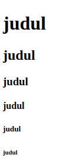
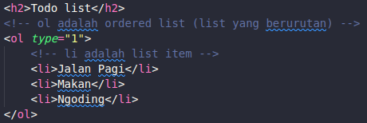
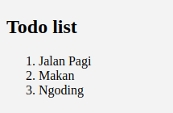
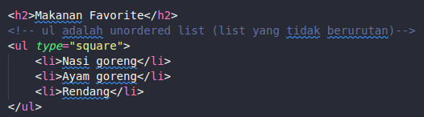
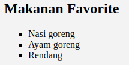
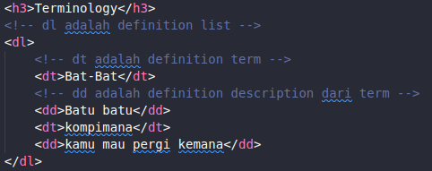
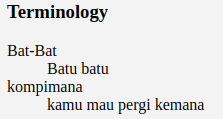

<div style="text-align: center"><h1>Tag HTML</h1></div>


## Tag didalam ```<head></head>```

- ```<meta>```
> meta digunakan untuk mendeskripsikan tentang website kita, juga mempermudah search enggine mengidentifikasi website kita

- ```<title></title>```
> tag ini digunakan untuk memberi nama pada website kita

## Tag didalam ```<body></body>```
Ada banyak tag yang bisa di masukan didalam body diantaranya:

- text
  ```<h1>, <h2>, <h3>, ..., <p> ...```
- pendukung text
  ```<br>, <hr>, <em>, <strong>, ...```
- gambar
  ``````
- hyper link
  ```<a>```
- list (bulets & numbering)
  ```<ul>, <ol>, <li>, <dl>, <dt>, <dd>,```
- table
  ```<table>, <thead>, <tbody>```
- form
  ```<form>, <input>, <select>, <button> ...```
- script
  ```<script>```
- object
  ```<object>```
- grouping
  ```<div>, <span>```


## Structure tag

### ```<namatag attribute="nilai">```
contoh:
>```<div class="pembungkus"></div>```


> &nbsp;&nbsp;&nbsp;&nbsp;attribute yang bisa digunakan:
> - acceskey
> - id
> - class
> - dir
> - land
> - style
> - tabindex
> - title


## Penggunaan tag ```<h1> - <h6>```




## Tag list
- **ol (ordered list)**

code:



result:



- **ul (unordered list)**
code:



result:



- **dl (definition list)**
code:



result:


